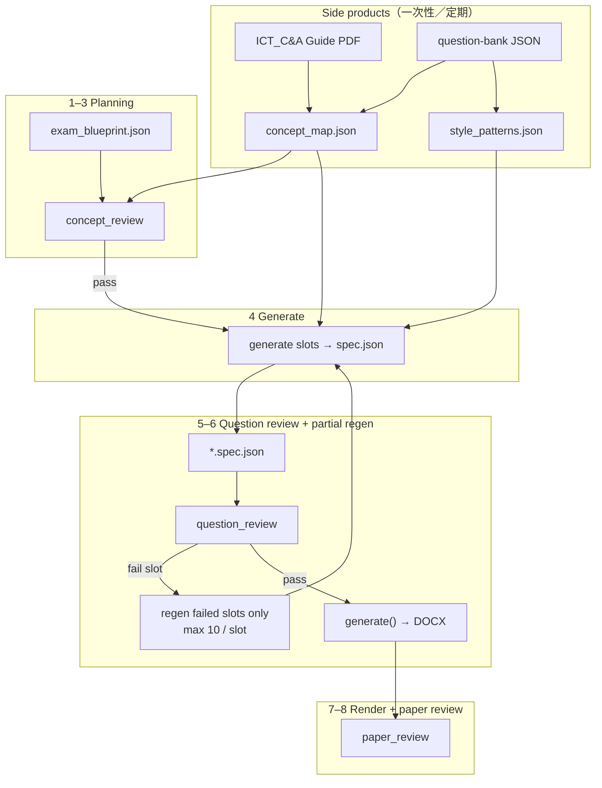

---
name: generate-f5-ict-exam
description: >-
  End-to-end workflow to build an S5 ICT school exam: concept blueprint,
  DSE-style generation (not bank copy), concept/question/paper review, DOCX
  deliverable. Use when generating or regenerating 中五 ICT 試卷, Term 2 Exam02,
  past-papers under Subjects/S5-ICT, or when the user wants a paper that feels
  like DSE but is not traceable to one DSE year.
---

# Generate S5 ICT exam

## Target architecture（目標流程，2026-05 起）

**原則：** question-bank 唔再 **抄題**；bank + C&A Guide 只提供 **concept map** 同 **問法／語法／專有名詞** patterns。題目由 blueprint **生成**，similarity 喺 **question review** 階段驗證，唔喺 pick 階段 hard-block 成卷。

| Layer | Artifact | Checks |
|-------|----------|--------|
| **Side products** | `concept_map.json`（tree）、`style_patterns.json` | 定期由 bank + `edb/ICT_C&A Guide_c_final.pdf` 更新 |
| **Planning** | `exam_blueprint.json` | **concept_review** |
| **Intellect** | `_generation/*.spec.json` | **question_review** |
| **Execution** | `WrittenExam/*.docx` | **paper_review**（spec == docx） |

**Mandatory order:**

1. 設計考核比例 → `exam_blueprint.json`
2. 從 DSE bank / past paper 統計攞 **concepts**（唔攞 stem 原文）
3. **concept_review** — 重覆、對 C&A concept map、common mistakes、out-of-syllabus
4. **generate** — 按 style patterns 自製每 slot 題目（agent 或 `generate_item` tool）
5. **question_review** — vs bank／校內 past、乙丙 coherence、缺答案、前文後理
6. Fail → **只 regen 有問題 slot**，每 slot **最多 10 次**；仍 fail → `unresolved_slots` report，**唔 loop 成卷**
7. Pass → **render DOCX**（甲部、封面、footer 要準；乙丙 render 持續改善）
8. **paper_review** — footer／cover／乙丙結構；written spec↔DOCX ≥92%



詳細 schema、實施 phase、工具清單 → [`reference.md`](reference.md) 及 `shared-tools/paper-generator/F5_ICT_CONCEPT_GENERATE_FLOW.md`。

---

## Review CLI 別名

| 目標名 | CLI |
|--------|-----|
| concept_review | `concept_review.py` |
| question_review | `question_review.py` |
| paper_review | `paper_review.py` |

改 spec 後只跑 review：

```bash
.venv/bin/python shared-tools/paper-generator/question_review.py
.venv/bin/python shared-tools/paper-generator/paper_review.py
```

舊 bank pick（慢）：`regenerate_exam02.py --legacy-pick`

```bash
# 以下仍可用 run_question_spec_check，等同 question_review.py
.venv/bin/python -c "
from pathlib import Path
import sys
sys.path.insert(0, 'shared-tools/paper-generator')
from post_check import run_question_review
raise SystemExit(run_question_review(
    candidate_spec=Path('Subjects/S5-ICT/assessments/2025-2026/Term 02/_generation/25_26_S5_ICT_Exam02.spec.json'),
    template=Path('Subjects/S5-ICT/past-papers/2024-2025/Term 02/WrittenExam/24_25_S5_ICT_Exam02.docx'),
    subject_subpath='S5-ICT',
))
"
```

---

## What “done” looks like

1. **Feels like DSE** — Core A/B/D MCQ + Paper 1B/2-style 乙丙；用語跟 `dse_ict_style_guide.json` / `style_patterns.json`。
2. **Grounded in curriculum** — concepts 對齊 `concept_map.json`（來源：`edb/ICT_C&A Guide_c_final.pdf` + bank 統計）。
3. **Not traceable** — 唔係抄 DSE 某一條；question_review 確認 vs bank／校內 past 相似度合理（甲部 stem 目標 ≤60% 仍作 **review 指標**，唔作 pick gate）。
4. **Depth calibration (iClass HK)** — 每 slot 自動附 `depth_references`（相關 iClass 題預覽）；Core D／Python／算法／除錯等概念會參考深淺出題。詳見 `iclass_hk_depth.py`、`iclass-hk/depth_profile.json`。
5. **School template** — `24_25_S5_ICT_Exam02.docx` 排版；spec 為內容 source of truth。

---

## Agent checklist（目標流程）

### 0 — Confirm scope

| Item | Default (Term 2 Exam02) |
|------|-------------------------|
| Subject path | `Subjects/S5-ICT/past-papers/{YYYY-YYYY}/Term 02/` |
| Template DOCX | Prior year `WrittenExam/*_Exam02.docx` |
| Output DOCX | `WrittenExam/{YY}_{YY}_S5_ICT_Exam02.docx` |
| Generation dir | `_generation/` |
| C&A Guide | `Subjects/DSE-ICT/edb/ICT_C&A Guide_c_final.pdf` |
| Bank | `Subjects/DSE-ICT/question-bank/` |
| Core D depth (iClass HK) | `Subjects/DSE-ICT/iclass-hk/depth_profile.json` + `iclass-hk/json/*.json` |
| Side products | `_generation/concept_map.json`, `style_patterns.json`（待建） |
| Python | `.venv/bin/python` from repo root |

### 1 — Blueprint

```bash
.venv/bin/python shared-tools/paper-generator/build_exam_blueprint.py --out \
  "Subjects/S5-ICT/assessments/2025-2026/Term 02/_generation/exam_blueprint.json"
```

- 甲 30（Core A×10 → B×10 → D×10）、乙 6、丙 7（無 c-04）；由 `mcq_core_plan` + `WRITTEN_SLOT_PLAN` 自動生成。
- 可手改 `exam_blueprint.json` 內 `concepts[]` / `marks` 後再跑 review。

### 2 — concept_review

```bash
.venv/bin/python shared-tools/paper-generator/build_exam_blueprint.py --review
# 或 concept_review.py --blueprint … --json …/exam_blueprint.concept_review.json
```

- 檢查：`concept_targets`、MCQ A→B→D、`out_of_syllabus`、F5 scope、slot 概念重疊、未知 concept。
- 輸出：`exam_blueprint.concept_review.json`；**PASS（exit 0）** 後進入 generate。

### 3 — Generate → spec

```bash
.venv/bin/python shared-tools/paper-generator/generate_from_blueprint.py \
  --concept-review --question-check --set-written-picks
```

- 每 slot：`f5_ict_generate_from_blueprint.py` 用 `style_patterns` + blueprint **寫新題**（`generated://…`，唔貼 bank stem）。
- 輸出：`25_26_S5_ICT_Exam02.spec.json`（43 items）；MCQ key 自動 balance。

### 4 — question_review + partial regen

```bash
# Generate + auto partial regen (2 rounds, 10 tries/slot)
.venv/bin/python shared-tools/paper-generator/generate_from_blueprint.py \
  --partial-regen --regen-rounds 3 --question-check

# Or regen an existing spec only
.venv/bin/python shared-tools/paper-generator/partial_regen_spec.py --rounds 3
```

- `run_question_spec_check`（過渡名；日後 `question_review`）。
- Fail slot → `partial_regen.py` 只改該 slot，最多 10 次／輪；報告 `*.partial_regen.json`。

### 5 — Render + paper_review

```bash
.venv/bin/python shared-tools/paper-generator/render_from_spec.py --force
# --force：question_review 有 duplicate 仍可 render；paper_review 仍會跑
```

- **輸入：** `25_26_S5_ICT_Exam02.spec.json` + 模板 `24_25_S5_ICT_Exam02.docx`
- **輸出：** `WrittenExam/25_26_S5_ICT_Exam02.docx`
- `spec_mcq_render.py`：spec 甲部 → template row blocks；`written_picks_render`：乙丙全文
- `run_post_render_check`：footer/cover + written spec↔DOCX ≥92%
- **唔好**喺 DOCX 改題目文字；改 spec → 再 `render_from_spec.py`

### 6 — One-shot build (optional)

```bash
.venv/bin/python shared-tools/paper-generator/build_f5_exam02.py --force-render
```

等同 Phase 3–6；`regenerate_exam02.py`（無參數）亦會轉發此腳本。

### 7 — Publish

- Git：交付用 DOCX + spec；`_generation` 審計檔可 commit。
- Panel S：只 final DOCX/PDF，**要明示許可**（`panel-storage-sync`）。

---

## Exam structure (fixed)

| 部分 | 對應 DSE | 內容 |
|------|----------|------|
| 甲部 | Paper 1A | 30 MCQ，Core A/B/D only |
| 乙部 | Paper 1B | 6 結構題，無 MC |
| 丙部 | Paper 2 (A+C) | 8 結構題，數據庫選修，無 MC |

---

## Hard rules

1. **Tool-first** — `shared-tools/`；唔好喺 chat 貼成卷。
2. **Spec before DOCX** — question 迭代停喺 render 前。
3. **No bank copy** — bank 只供 patterns + concept 統計；生成題用新情境／數字。
4. **Partial regen** — max 10 attempts per failed slot；唔 re-seed 成卷。
5. **Privacy** — 唔 commit 成績／學生名單。
6. **Panel share** — 唔寫 `S:\...\08_Others` 除非用戶准許。

---

## Implementation status

| Phase | 內容 | 狀態 |
|-------|------|------|
| **0** | 本文檔 + skill / flow 文檔 | ✅ |
| **1** | `extract_style_patterns.py` → `style_patterns.json` | ✅ |
| **2** | `build_concept_map.py` → `concept_map.json` tree | ✅ |
| **3** | `exam_blueprint.json` + `concept_review` CLI | ✅ |
| **4** | `generate_from_blueprint.py` → spec | ✅ |
| **5** | `partial_regen_spec.py` + `--partial-regen` | ✅ |
| **6** | `render_from_spec.py` + paper_review | ✅ |
| **7** | `build_f5_exam02.py`；review CLI；pick gate off；legacy 清理 | ✅ |

---

## Related docs

- Commands & thresholds: [reference.md](reference.md)
- Technical flow & schemas: `shared-tools/paper-generator/F5_ICT_CONCEPT_GENERATE_FLOW.md`
- Spec/DOCX detail: `shared-tools/paper-generator/EXAM_SPEC_AND_DOCX.md`
- Rule: `.qoder/rules/paper-generator.md`
