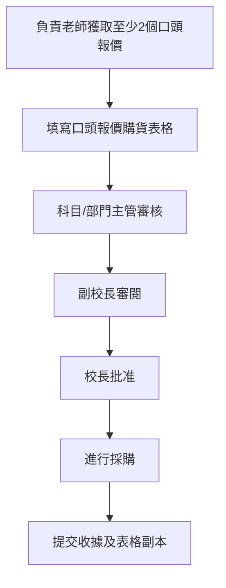
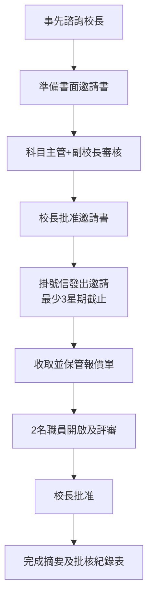

# CHW 採購程序指南 / Purchasing Procedures Manual

**最後更新 / Last Updated:** 2026年8月 / August 2026  
**適用範圍 / Scope:** 所有教職員 / All teaching and administrative staff

---

## 📋 目錄 / Table of Contents

1. [概述 / Overview](#概述-overview)
2. [採購金額分級 / Purchase Amount Tiers](#採購金額分級-purchase-amount-tiers)
3. [$5,000或以下 / ≤$5,000 Purchases](#5000或以下-5000-purchases)
4. [$5,001-$50,000 / $5,001-$50,000 Purchases](#5001-50000-5001-50000-purchases)
5. [$50,001-$200,000 / $50,001-$200,000 Purchases](#50001-200000-50001-200000-purchases)
6. [$200,000以上 / >$200,000 Purchases](#200000以上-200000-purchases)
7. [重要規定 / Important Requirements](#重要規定-important-requirements)
8. [付款與收貨程序 / Payment & Receiving Procedures](#付款與收貨程序-payment--receiving-procedures)
9. [常見問題 / FAQ](#常見問題-faq)
10. [相關表格 / Related Forms](#相關表格-related-forms)

---

## 概述 / Overview

本手冊根據教育局《資助學校採購程序指引》及陳樹渠紀念中學內部規定編寫，旨在規範學校採購程序，確保公帑妥善運用。

This manual is based on the Education Bureau's "Guidelines on Procurement Procedures in Aided Schools" and CHW internal policies, designed to standardize school procurement procedures and ensure proper use of public funds.

### 核心原則 / Core Principles

- **公平競爭 / Fair Competition:** 按金額要求適當數目的報價或投標
- **透明度 / Transparency:** 完整記錄採購決策過程
- **問責性 / Accountability:** 明確審批權限和責任分工
- **利益申報 / Conflict of Interest:** 所有參與採購人員必須申報利益衝突
- **禁止拆單 / Anti-Splitting:** 嚴禁將大額採購拆分以規避競價要求

---

## 採購金額分級 / Purchase Amount Tiers

| 金額範圍 / Amount Range | 競價要求 / Quotation Requirement | 審批權限 / Approval Authority |
|------------------------|----------------------------------|-------------------------------|
| ≤ $5,000 | 無需競價 / No quotation needed | 校長認證 / Principal certifies |
| $5,001 - $50,000 | 至少2個口頭報價 / ≥2 oral quotations | 校長批准 / Principal approves |
| $50,001 - $200,000 | 至少5個書面報價 / ≥5 written quotations | 校長批准 / Principal approves |
| > $200,000 | 至少5個投標 / ≥5 tenders | 招標審批委員會 / Tender Approving Committee |

### ⚠️ 累計限制 / Cumulative Limits

**同一項目12個月內累計採購不得超過：**
- 口頭報價方式：$50,000
- 書面報價方式：$200,000

**Cumulative purchases of the same items within 12 months must not exceed:**
- Oral quotation method: $50,000
- Written quotation method: $200,000

---

## $5,000或以下 / ≤$5,000 Purchases

### 適用情況 / When to Use

小額日常採購，如文具、教學用品、小型設備維修等。

Small daily purchases such as stationery, teaching materials, minor equipment repairs, etc.

### 程序步驟 / Procedure Steps

1. **申請人 / Applicant:**
   - 填寫「申請購買物品表格($5000元或以下)」
   - 聲明此為單一採購，非拆分訂單
   - Fill in "Application for Purchase of Items Form (≤$5,000)"
   - Declare this is a single procurement, not splitting orders

2. **科目/部門主管 / Subject Panel Head or Department Head:**
   - 審核採購必要性及合理性
   - Review necessity and reasonableness

3. **副校長 / Vice Principal:**
   - 審閱申請
   - Review application

4. **校長 / Principal:**
   - 認證採購屬必需且價格公平合理
   - Certify that purchase is essential and price is fair/reasonable

5. **採購後 / After Purchase:**
   - 提交收據正本 + 已批准的申請表給會計
   - Submit original receipt + approved form to school accountant
   - 在收據右上角寫上「由XX支付」/ Write "Paid by XX" on top-right corner of receipt
   - 熱敏紙收據需先影印以防褪色 / Photocopy thermal paper receipts first to prevent fading

### 所需文件 / Required Documents

- ✅ 申請購買物品表格($5000元或以下)
- ✅ 收據正本（或發票）
- ✅ 利益申報表（如適用）

---

## $5,001-$50,000 / $5,001-$50,000 Purchases

### 適用情況 / When to Use

中等金額採購，如教材套裝、活動物資、小型服務合約等。

Medium-value purchases such as textbook sets, event supplies, small service contracts, etc.

### 程序步驟 / Procedure Steps

#### 第一步：獲取報價 / Step 1: Obtain Quotations

**關鍵規則 / Key Rules:**

1. **最少2個報價 / Minimum 2 quotations:**
   - 必須向不同供應商獲取至少2個口頭報價
   - Must obtain at least 2 oral quotations from different suppliers

2. **規格一致 / Identical specifications:**
   - 所有報價的物品/服務規格必須完全相同
   - All quoted items/services must have identical specifications

3. **親自獲取 / Obtain personally:**
   - **負責老師必須親自獲取報價**
   - **Responsible teacher must obtain quotes personally**
   - ❌ 不可要求一間供應商協助收集其他供應商的報價
   - ❌ Never ask one supplier to help collect other suppliers' quotes

4. **獲取方式 / Methods:**
   - 電話 / Phone call
   - 傳真 / Fax
   - 電郵 / Email
   - 必須註明截止日期和時間 / Must specify deadline date and time

5. **書面證據 / Written evidence:**
   - 盡可能保留書面證據（電郵、網站截圖等）
   - Keep written evidence where possible (emails, website screenshots, etc.)

#### 第二步：填寫表格 / Step 2: Complete Form

**按口頭報價購貨表格 / Purchase-by-Oral Quotation Form (EDB Annex II)**

需要填寫的內容 / Required information:

- 物品/服務詳細描述 / Detailed description of items/services
- 各供應商報價詳情 / Quotation details from each supplier
- 選擇建議及理由 / Recommendation and reasons for selection
- **如不選擇最低報價，必須說明原因** / **If not selecting lowest quote, must record reasons**
- 如無法獲取足夠報價，須解釋原因並由科目主管或MPS 25或以上職員簽署 / If unable to get sufficient quotes, explain reasons and have Panel Head or staff ≥ MPS Point 25 endorse

#### 第三步：審批流程 / Step 3: Approval Chain

1. **負責老師 / Responsible Teacher:**
   - 完成表格並提出建議
   - Complete form with recommendation

2. **科目/部門主管 / Subject Panel Head or Department Head:**
   - 審核報價程序及建議
   - Review quotation process and recommendation

3. **副校長 / Vice Principal:**
   - 審閱
   - Review

4. **校長 / Principal:**
   - 最終批准
   - Final approval

#### 第四步：採購及記錄 / Step 4: Purchase & Documentation

- 提交收據正本 + **校長批准的口頭報價表格副本** 給會計
- Submit original receipt + **copy of Principal-approved Oral Quotation Form** to accountant
- 所有報價記錄及表格必須保存**3個曆年**以備審計
- Keep all quotation records and forms for **3 calendar years** for audit

### 所需文件 / Required Documents

- ✅ 按口頭報價購貨表格（EDB附件II）
- ✅ 至少2個口頭報價的書面證據
- ✅ 收據正本
- ✅ 利益申報表（如適用）

---

## $50,001-$200,000 / $50,001-$200,000 Purchases

### 適用情況 / When to Use

大額採購，如大型設備、裝修工程、長期服務合約等。

Large-value purchases such as major equipment, renovation works, long-term service contracts, etc.

### 程序步驟 / Procedure Steps

#### 第一步：事前準備 / Step 1: Preparation

1. **諮詢校長 / Consult Principal:**
   - 在準備邀請書前必須先與校長商討
   - Must consult with Principal before preparing invitation

2. **準備書面邀請書 / Prepare Written Invitation:**
   - 使用學校正式信箋 / Use official school letterhead
   - 清楚列明規格、數量、交貨期、付款條款等
   - Clearly specify specifications, quantities, delivery timeline, payment terms, etc.
   - 必須包含供應商聲明條款 / Must include supplier declaration clause

3. **審核邀請書 / Review Invitation:**
   - 科目/部門主管審核
   - Subject Panel Head/Department Head reviews
   - 副校長審閱
   - Vice Principal reviews
   - 校長批准
   - Principal approves

#### 第二步：發出邀請 / Step 2: Dispatch Invitations

1. **發送方式 / Method:**
   - **必須以掛號信寄出** / **Must send by registered mail**
   - 至少5個供應商 / At least 5 suppliers

2. **時間要求 / Timeline:**
   - **一般情況：** 邀請日期至截止日期最少**3星期**
   - **Normal:** Minimum **3 weeks** between invitation date and closing date
   - **緊急情況：** 校長可縮短至**2個完整工作天**，但須記錄原因
   - **Urgent cases:** Principal may reduce to **2 clear working days** with reasons recorded

#### 第三步：收取及管理 / Step 3: Receive & Manage

1. **保管報價單 / Secure Quotations:**
   - 收到的報價單必須**上鎖保管**
   - Received quotations must be **locked up**
   - 鑰匙由適當職員保管 / Key held by appropriate staff

2. **開啟報價單 / Opening Quotations:**
   - 校長委任**2名職員**開啟、審查及轉交科目老師評估
   - Principal appoints **2 staff members** to open, vet, and refer to subject teachers for evaluation

#### 第四步：評審及批准 / Step 4: Evaluation & Approval

1. **評審 / Evaluation:**
   - 科目老師評估技術規格符合程度
   - Subject teachers evaluate technical specification compliance
   - 填寫「書面報價/投標摘要及批核紀錄表」（EDB附件IV）
   - Complete "Written Quotation Summary & Approval Record" (EDB Annex IV)

2. **批准 / Approval:**
   - 校長最終批准
   - Principal gives final approval

3. **記錄保存 / Record Keeping:**
   - 所有原件及文件保存**3個曆年**
   - Keep all originals and documents for **3 calendar years**

### 所需文件 / Required Documents

- ✅ 書面報價邀請書
- ✅ 至少5個書面報價單
- ✅ 書面報價/投標附表
- ✅ 書面報價/投標表格
- ✅ 書面報價/投標摘要及批核紀錄表（EDB附件IV）
- ✅ 利益申報表（如適用）

---

## $200,000以上 / >$200,000 Purchases

### 適用情況 / When to Use

重大採購，如大型基建、主要設備更新、長期外判服務等。

Major purchases such as large-scale infrastructure, major equipment upgrades, long-term outsourced services, etc.

### 特殊要求 / Special Requirements

#### 1. 投標箱 / Tender Box

- 必須使用**雙重上鎖投標箱** / Must use **double-locked tender box**
- 放置於總辦事處固定且方便的位置
- Placed in fixed, convenient location in General Office
- 兩條鑰匙由不同職員保管（其中一人為監督級別）
- Two keys held by different staff (one at supervisory rank)

#### 2. 開標及評審委員會 / Tender Opening & Vetting Committee (TOVC)

**組成 / Composition:**
- 2名成員 / 2 members
- 一人薪級點≥MPS 25 / One member ≥ MPS Point 25
- 一人≥文書助理級別 / One member ≥ Clerical Assistant rank

**委任時間 / Appointment Timing:**
- 至少在開標前**3個工作天**委任
- Appointed at least **3 working days** before opening

**職責 / Responsibilities:**
- 開啟投標箱
- Open tender box
- 審查投標書
- Vet tenders
- 轉交科目老師評估
- Refer to subject teachers for evaluation

#### 3. 招標審批委員會 / Tender Approving Committee (TAC)

**必須包括 / Must Include:**
- 校監/校董 / School Supervisor/Manager
- 校長 / Principal
- 一名教師 / One teacher
- 一名家教會代表或家長校董 / One PTA representative or parent manager

**重要規定 / Critical Rule:**
- TOVC和TAC成員**必須是不同的人**
- TOVC and TAC members must be **different people**
- 參與評估的老師不得擔任任一委員會成員
- Evaluating teachers cannot be on either committee

#### 4. 國家安全條款 / National Security Clause

所有投標文件必須包含國家安全條款，允許學校因國家安全理由取消供應商資格或終止合約。

All tender documents must include national security clause allowing school to disqualify suppliers or terminate contracts for national security reasons.

### 程序概要 / Procedure Overview

基本程序與$50,001-$200,000類似，但增加：

Basic procedure similar to $50,001-$200,000, but with additions:

1. 使用投標箱 / Use tender box
2. TOVC開標及評審 / TOVC opens and vets
3. 科目老師評估 / Subject teacher evaluation
4. TAC最終批准 / TAC final approval

### 所需文件 / Required Documents

- ✅ 投標邀請書
- ✅ 至少5個投標書
- ✅ 投標附表
- ✅ 投標表格
- ✅ 投標摘要及批核紀錄表
- ✅ TOVC及TAC會議記錄
- ✅ 利益申報表（所有相關人員）

---

## 重要規定 / Important Requirements

### A. 供應商聲明 / Supplier Declaration

所有報價/投標必須包含以下聲明：

All quotations/tenders must include this declaration:

**中文：**
> 「本人/本公司謹此聲明，本人/本公司所提供的商品或服務內容不會涉及違反香港特別行政區的任何法例。」

**English:**
> "I/My company hereby declare(s) that the goods/services provided by me/my company will not violate any legislation in HKSAR."

### B. 疫情/停課條款 / Pandemic/Disruption Clauses

供應商必須說明如因疫情或教育局宣佈停課而無法提供服務時的安排（例如：退貨、延期、退款等）。

Suppliers must specify terms for inability to deliver due to pandemic or EDB class suspension (e.g., return, rescheduling, refund arrangements).

### C. 校外導師/教練特別規定 / External Tutors/Coaches Special Rules

#### 恆常到校導師 / Regular On-Campus Tutors

**要求 / Requirements:**
- 必須提供資格證明 / Must provide proof of qualifications
- 必須自費進行**性罪行定罪記錄檢查** / Must undergo **sexual conviction record check** at own expense
- 結果須於第一堂前提交 / Results due by first class day
- 合約必須包含不違法聲明 / Contract must include non-violation declaration

#### 單次服務提供者/嘉賓講者 / One-off Service Providers/Guest Speakers

**要求 / Requirements:**
- 無需性罪行定罪記錄檢查 / No sexual conviction record check required
- 但必須填寫「校外服務提供者/講者聲明」表格
- But must complete "External Service Provider/Speaker Declaration" form

### D. 利益衝突申報 / Conflict of Interest Declaration

**適用對象 / Who Must Declare:**
- 所有參與採購程序的職員
- All staff involved in procurement procedures

**申報內容 / What to Declare:**
- 與供應商有任何關連（親屬、僱主、股東等）
- Any connection with suppliers (relatives, employers, shareholders, etc.)

**後果 / Consequences:**
- 已申報利益的職員必須**迴避處理**相關報價/投標
- Declared staff must **refrain from handling** related quotations/tenders

**頻率 / Frequency:**
- 每年簽署一次 / Sign annually

### E. 單一來源採購 / Single-Source Procurement

**僅在以下情況允許 / Only permitted when:**
- 只有一個潛在供應商 / Only one potential supplier exists
- 版權或技術原因 / Copyright/technical reasons
- 公用事業機構服務 / Utility company services
- 專利設備保養（保用期內）/ Patent equipment maintenance under warranty

**審批要求 / Approval Requirements:**
- ≤$50,000：科目主管或MPS 25或以上職員
- ≤$50,000: Panel Head or staff ≥ MPS Point 25
- >$50,000：**校管會（SMC/IMC）**
- >$50,000: **School Management Committee**

---

## 付款與收貨程序 / Payment & Receiving Procedures

### 付款程序 / Payment Procedures

#### 原則 / Principle

- **優先使用學校付款**，盡量減少教職員墊支
- **School payment preferred** — minimize staff personal payments

#### 如教職員墊支 / If Staff Pays

1. **支付方式 / Payment Method:**
   - 優先使用現金 / Preferably use cash
   - **信用卡需事先獲得校長批准**
   - **Credit card requires prior Principal approval**

2. **收據處理 / Receipt Handling:**
   - 在收據右上角寫上「由XX支付」
   - Write "Paid by XX" on top-right corner of receipt
   - 熱敏紙收據必須先影印以防褪色
   - Thermal paper receipts must be photocopied first to prevent fading
   - 將正本貼在影印本旁邊
   - Attach original beside the photocopy

3. **提交文件 / Submit Documents:**
   - 收據正本 + 已批准的採購表格副本
   - Original receipt + copy of approved purchase form
   - 交給學校會計 / Submit to school accountant

### 收貨程序 / Receiving Procedures

#### 貨品送達 / Goods Delivery

1. **接收 / Receiving:**
   - 學校辦事處職員接收貨品
   - School office staff receives goods
   - 蓋上「收貨印」/ Stamp with **"Receiving Stamp"**

2. **驗收 / Inspection:**
   - 負責老師必須盡快檢查貨品
   - Responsible staff must inspect goods promptly
   - 如有問題立即報告 / Report issues immediately

3. **記錄 / Recording:**
   - 對於送貨訂單，在辦事處佈告板張貼「待收貨紀錄」
   - For deliveries, post "Pending Delivery Record" on school office bulletin board

---

## 常見問題 / FAQ

### Q1: 我可以將$60,000的採購分成兩個$30,000訂單嗎？
### Q1: Can I split a $60,000 purchase into two $30,000 orders?

**答 / Answer:** ❌ **絕對不可以 / Absolutely NOT**

這是「拆單」行為，嚴重違反採購指引。同一項目12個月內累計採購不得超過該層級的上限。

This is "order splitting," a serious violation of procurement guidelines. Cumulative purchases of the same items within 12 months must not exceed the tier limit.

---

### Q2: 如果只能找到一個供應商怎麼辦？
### Q2: What if I can only find one supplier?

**答 / Answer:** 

這屬於「單一來源採購」，需要特別審批：

This is "single-source procurement" requiring special approval:

- ≤$50,000：由科目主管或MPS 25或以上職員批准並記錄原因
- ≤$50,000: Approved by Panel Head or staff ≥ MPS Point 25 with reasons recorded
- >$50,000：必須提交校管會（SMC/IMC）批准
- >$50,000: Must submit to School Management Committee (SMC/IMC) for approval

---

### Q3: 口頭報價需要書面證據嗎？
### Q3: Do oral quotations need written evidence?

**答 / Answer:** ✅ **強烈建議 / Strongly recommended**

雖然稱為「口頭報價」，但應盡可能保留書面證據：

Although called "oral quotations," written evidence should be kept where possible:

- 電郵往來 / Email correspondence
- 傳真確認 / Fax confirmation
- 網站價格截圖 / Website price screenshots
- 電話記錄（日期、時間、聯絡人、報價內容）
- Phone call records (date, time, contact person, quote details)

---

### Q4: 誰可以開啟投標箱？
### Q4: Who can open the tender box?

**答 / Answer:** 

只有校長委任的**開標及評審委員會（TOVC）**成員可以開啟：

Only the **Tender Opening & Vetting Committee (TOVC)** members appointed by the Principal can open it:

- 2名成員 / 2 members
- 一人薪級點≥MPS 25 / One ≥ MPS Point 25
- 一人≥文書助理級別 / One ≥ Clerical Assistant rank
- 至少在開標前3個工作天委任
- Appointed at least 3 working days before opening

---

### Q5: 採購文件需要保存多久？
### Q5: How long should procurement documents be kept?

**答 / Answer:** 📅 **3個曆年 / 3 calendar years**

所有報價單、投標書、審批記錄等必須保存至少3個曆年以備審計。

All quotations, tenders, approval records, etc. must be kept for at least 3 calendar years for audit purposes.

---

### Q6: 我可以用信用卡支付採購款項嗎？
### Q6: Can I use credit card for purchases?

**答 / Answer:** ⚠️ **需要事先批准 / Prior approval required**

- 優先使用現金 / Preferably use cash
- **信用卡必須事先獲得校長批准**
- **Credit card requires prior Principal approval**
- 保留所有交易記錄 / Keep all transaction records

---

### Q7: 校外導師需要進行性罪行定罪記錄檢查嗎？
### Q7: Do external tutors need sexual conviction record checks?

**答 / Answer:** 

視乎服務性質 / Depends on service nature:

- **恆常到校導師：** ✅ 必須進行（自費），結果於第一堂前提交
- **Regular on-campus tutors:** ✅ Must undergo (at own expense), results due by first class day
- **單次服務提供者/嘉賓講者：** ❌ 不需要，但須填寫聲明表格
- **One-off providers/guest speakers:** ❌ Not required, but must complete declaration form

---

## 相關表格 / Related Forms

### 學校內部表格 / School Internal Forms

| 表格名稱 / Form Name | 適用金額 / Applicable Amount | 位置 / Location |
|---------------------|------------------------------|----------------|
| 申請購買物品表格($5000元或以下) | ≤ $5,000 | `templates/` |
| 按口頭報價購貨表格 | $5,001 - $50,000 | `templates/` |
| 利益申報表 | 所有採購（如適用） | `templates/` |

### 教育局標準表格 / EDB Standard Forms

| 表格編號 / Form No. | 表格名稱 / Form Name | 適用金額 / Applicable Amount |
|--------------------|---------------------|------------------------------|
| 附件 II / Annex II | 按口頭報價購貨表格 / Purchase-by-Oral Quotation Form | $5,001 - $50,000 |
| 附件 III / Annex III | 書面報價邀請書 / Written Quotation Invitation | $50,001 - $200,000 |
| 附件 IV / Annex IV | 書面報價/投標摘要及批核紀錄表 / Written Quotation Summary & Approval Record | $50,001+ |

### 參考文件 / Reference Documents

- 📄 [教育局《資助學校採購程序指引》（中文版，2023年6月）](https://www.edb.gov.hk)
- 📄 [EDB Guidelines on Procurement Procedures in Aided Schools (English, Apr 2013)](https://www.edb.gov.hk)
- 📄 [CHW採購指引（2026年8月修訂）](./templates/20260820_CHW_採購指引.pdf)

---

## 聯絡資訊 / Contact Information

如有疑問，請聯絡：

For enquiries, please contact:

- **學校會計 / School Accountant:** [聯繫方式待補充]
- **總務處 / General Office:** [聯繫方式待補充]
- **副校長（行政）/ Vice Principal (Admin):** [聯繫方式待補充]

---

## 版本記錄 / Version History

| 版本 / Version | 日期 / Date | 更新內容 / Changes |
|---------------|-------------|-------------------|
| 1.0 | 2026-08-26 | 初始版本，基於EDB指引及CHW內部規定 / Initial version based on EDB guidelines and CHW internal policies |

---

**⚠️ 重要提示 / Important Notice:**

本手冊僅供參考，實際採購程序請以最新教育局指引及學校規定為準。如有疑問，請諮詢學校會計或行政人員。

This manual is for reference only. Actual procurement procedures should follow the latest EDB guidelines and school regulations. For enquiries, please consult the school accountant or administrative staff.
