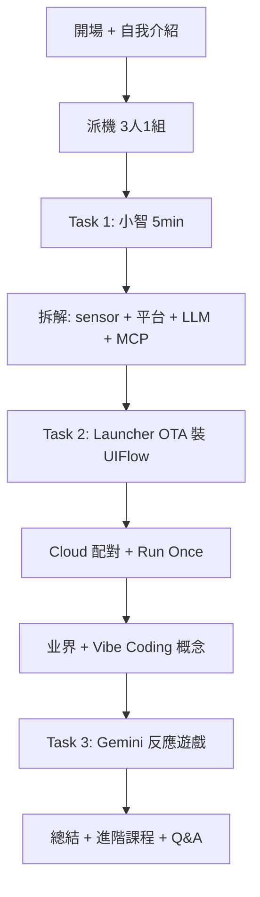

# STEAM 分享：M5StickS3 — 教案（教師分享會）

**主題：** 《STEAM 分享：M5StickS3》  
**分享場地：** YL Long Ping Estate Wai Chow School（元朗朗屏邨惠州學校）  
**分享者：** Warren Chan · Carmel Holy Word Secondary School（迦密聖道中學）  
**日期時間：** 2026 年 6 月 22 日（星期一）14:00 – 15:30（90 分鐘）  
**對象：** 惠州學校及聯校 **STEAM、ICT、英文** 老師（教師 PD，非小學生課堂）  
**形式：** 20 部 StickS3，**三人一組**；每組 1 部機 + 自備 laptop（WiFi）

**配套文件：**

| 文件 | 用途 |
|------|------|
| [`ppt-speaker-notes.md`](ppt-speaker-notes.md) | 全堂講者稿（含自我介紹、三 Task、MCP 等） |
| [`participant-handout.md`](participant-handout.md) | 參與者跟做筆記（預留截圖位） |
| [`google-classroom-plan.md`](google-classroom-plan.md) | Google Classroom 運用方案 |
| [`feedback-form-meta.json`](feedback-form-meta.json) | 課後 Feedback Form 連結 |
| [`ppt-slides-gemini-prompts.md`](ppt-slides-gemini-prompts.md) | 25 張投影片英文 Gemini prompt（16:9） |
| [`../scripts/generate_ppt_slides.py`](../scripts/generate_ppt_slides.py) | 有 API key 後批量出圖 |
| [`../m5sticks3-clone/README.md`](../m5sticks3-clone/README.md) | 批量 clone / 小智綁定 |

---

## 分享目標

參與老師完成後能夠：

1. **親身試** 小智（英文導師、dark mode、播歌、天氣等）
2. 講出 **小智 backend**（平台 + LLM + 可選知識庫 / MCP）嘅概念
3. 经 **M5Launcher OTA** 安裝 **UIFlow 2**，配對 **uiflow2.m5stack.com**，**Run Once** 改畫面
4. 用 **Gemini Vibe Coding**（Google Classroom sample prompt）生成 **反應遊戲**
5. 理解 **Chatbot → Vibe Coding → Agentic AI** 同 **「业界已经唔人手写 code」** 嘅脈絡

---

## 講者背景（Slide 02）

- 中學老師，**專業為軟件工程師**，因家庭回歸校園  
- 小學教學主要靠 **兒子（小五）** 作為理解途徑  
- 請同事 **多多包涵**，歡迎提問  

---

## 概念框架

| 層次 | 對老師嘅意思 | 今日對應 |
|------|--------------|----------|
| **Chatbot** | 成品對話 AI | 小智 |
| **Vibe Coding** | 描述 → AI 出 code；人 review | UIFlow 2 + Gemini |
| **Agentic AI** | 目標 → 多步 plan + 工具 | Manus；講者 **進階課程** |

**Vibe Coding** = 由 Chatbot AI 走向 Agentic AI 嘅 **中轉站**。

---

## 硬體與分組

| 項目 | 安排 |
|------|------|
| M5StickS3 | **20 部**（M5Stack 缺貨限制） |
| 分組 | **3 位老師 / 組**，輪流操作 |
| 預載 | M5Launcher + 小智 + 學校 WiFi（见 clone 文件） |
| 電腦 | 瀏覽器開 [uiflow2.m5stack.com](https://uiflow2.m5stack.com/) |

### StickS3 三粒掣（Slide 04 — 必講）

| 掣 | 用途 |
|----|------|
| **Power（左側）** | 短按開機 / 喚醒；Task 1 入小智 |
| **BtnA** | UIFlow 遊戲、主操作 |
| **BtnB** | **M5Launcher 見字樣立刻按** — OTA 確認 |
| **Cloud（螢幕圖示）** | UIFlow 配對編號（非 physical 掣） |

### 裝置功能（Slide 05 — 口頭補充）

彩色屏、ESP32-S3、WiFi/BT、咪高峰、喇叭、六軸 IMU、紅外、RTC、電池。

---

## 流程總覽



| 段落 | 內容 | 時間 |
|------|------|------|
| 開場 | 主題、自我介紹、三 Task、StickS3 三掣 | 10′ |
| **Task 1** | 按 Power → 小智；扮小學生；**錄音提示** | 5′ |
| 講解 | 点解厲害：小智平台、LLM、NotebookLM 式知識庫、**MCP** | 10′ |
| **Task 2** | 退小智 → Launcher → **BtnB** → OTA → UIFlow；等候時講「手錶/筆袋機械人」 | 20′ |
| UIFlow 試玩 | Cloud 編號 → 網頁配對 → 改畫面 → **Run Once** | 10′ |
| 過渡 | STEAM 熟 block coding；**SW 工程師唔人手写 code** | 5′ |
| **Task 3** | Google Classroom prompt；**M5 API trick**；Gemini 反應遊戲 | 20′ |
| 收尾 | DeepSeek **下次**；Agentic / Manus；進階課程 | 10′ |

---

## Task 1：體驗小智（5 分鐘）

### 操作

1. **按一下左側 Power 掣**  
2. 等載入  
3. 同 **小智** 傾計（英文導師）

### 建議試玩（Slide 08）

| 指令（英文） | 目的 |
|--------------|------|
| Turn on dark mode | 展示非教學指令 |
| Play a song | 娛樂 / 多模態 |
| What's the weather? | 聯網能力 |
| How do you spell ___? | 英文課堂場景 |

### 合規

- 向同事說明：**對話可能被錄音**（視平台 / 校政設定）

---

## 講解：小智為何厲害

### 架構

```
語音 → 咪高峰 → WiFi → 小智平台 + LLM → （知識庫 / MCP）→ 喇叭
```

### 進階概念（對老師）

| 概念 | 一句解釋 |
|------|----------|
| **LLM** | 大語言模型 — 「識傾計」嘅腦 |
| **小智平台** | Backend — 裝置、語音、對話流程 |
| **知識庫** | 似 **NotebookLM** — 餵校內資料，答得更貼 curriculum |
| **MCP** | Model Context Protocol — AI **统一接駁工具 / 數據** 嘅「插口」 |

---

## Task 2：安裝 UIFlow 2

> ⚠️ 裝 UIFlow 會改 active app；小智仍留喺 Launcher，可切返。

### 步驟（全班同步）

1. 開 **M5Launcher**  
2. 見 **「M5Launcher」** 字樣 → **即刻按 BtnB**  
3. 入 **OTA** → 揀 **UIFlow 2（StickS3）**  
4. 等待安裝完成 → Reboot  

### 等候時（口頭）

AI 硬件可變 **手錶、筆袋機械人** 等 — 激发 STEAM 想像。

### 配對與試玩

1. 按 **Cloud** → 記 **Access Code**  
2. [uiflow2.m5stack.com](https://uiflow2.m5stack.com/) → Connect Device  
3. 改 label / 背景  
4. **Run Once** — 画面即時上機  

---

## 過渡：Vibe Coding 時代

### 對 STEAM 老師

- Block IDE **應該好熟** — 好多平台都係咁  
- 但好多同事 **唔想面对编程** — 正常  

### 工程師視角（講者核心 message）

> 业界 **已经唔人手逐行写 code**；交俾 AI，人 **review 唔好整爛 codebase**。  
> 所以 Task 3 係 **Vibe Coding**，唔係传统 programming 课。

---

## Task 3：Gemini Vibe Coding

### 前置

- 琦姐已教过 **Gemini** — 唔重复 intro  
- **Sample prompt 已发 Google Classroom** — Copy & Paste  

### M5 API 技巧（必講）

Generate 前要先俾 AI **StickS3 / UIFlow 2 context**：

- BtnA、BtnB 只得两粒  
- Widgets.Label、fillScreen 等  
- 否则 Gemini 会写错 platform  

### 範例目標：反應遊戲

- Wait… → 随机 1–5 秒 → **GO!** → 按 BtnA → 显示 ms  
- 太早按 → Too early!  

### 設計討論（Slide 21）

- **纯掣游戏** — 受限于两粒掣  
- **加语音** — 玩法完全不同；留俾同事同学生探索  

### Google Classroom Prompt 模板

```
You are coding for M5StickS3 on UIFlow 2 (MicroPython).
Available: BtnA, BtnB, Widgets.Label, Widgets.fillScreen, time, random.
Write a simple reaction game: show "Wait...", after random 1-5 seconds show "GO!" on green screen,
when BtnA pressed after GO show reaction time in milliseconds, if pressed before GO show "Too early!".
Keep it simple for primary students.
```

---

## DeepSeek（今次唔做）

- 原计划：駁 **DeepSeek API**，类小智但 **慢好多**  
- **下次 session** 再 demo  
- 今日时间留给 **Vibe Coding 体验**  

---

## 進階課程（收尾）

講者专业：**Professional Vibe Coding & Agentic AI**

- 课程 **深、门槛高**；有兴趣才学得到  
- 学完可 **大幅解放双手**（讲者校内经验：超正）  
- 部分同事已玩 **Manus** 等 Agentic AI — 欢迎日后再分享  

---

## 課前 Checklist（講者）

- [ ] 20 部机 WiFi + 小智可用  
- [ ] Google Classroom 已发 sample prompt  
- [ ] 投影 Slide 04（三掣图）清晰  
- [ ] 录音 / 私隐政策已向同事说明  
- [ ] 备用机：已装 UIFlow + 预生成 reaction game（防 Gemini fail）  
- [ ] uiflow2.m5stack.com 可访问  

---

## 時間压缩（60 分钟）

| 削减 | 做法 |
|------|------|
| MCP / NotebookLM | 一句带过 |
| Task 2 | 课前预装 UIFlow，现场只配對 + Run Once |
| Task 3 | 全组跟讲者 copy 同一 prompt |
| DeepSeek / 进阶 | 只口头 1 分钟 |

---

## 参考链接

- [StickS3 小智官方教學](https://docs.m5stack.com/zh_CN/guide/realtime/xiaozhi/sticks3)
- [StickS3 UIFlow 2](https://docs.m5stack.com/en/uiflow2/sticks3/program)
- [UIFlow 2 Web IDE](https://uiflow2.m5stack.com/)
- [M5Launcher](https://github.com/bmorcelli/Launcher)
- [DeepSeek API](https://api-docs.deepseek.com/)（下次）

---

## 附：小學生课堂 vs 是次分享會

| | 是次（老师 PD） | 小學生课堂 |
|--|----------------|------------|
| 对象 | 3 人一组老师 | 学生 |
| 开场 | SW 工程师自我介绍 | 简化 |
| Task 1 | 扮小学生 + 录音合规 | 直接玩 |
| 概念 | MCP、业界不写 code | 简化三层 AI |
| Task 3 | Google Classroom | 老师派 prompt 卡 |

若需 **小學生版教案**，可另开 `lesson-plan-primary-students.md`（保留旧版结构）。
