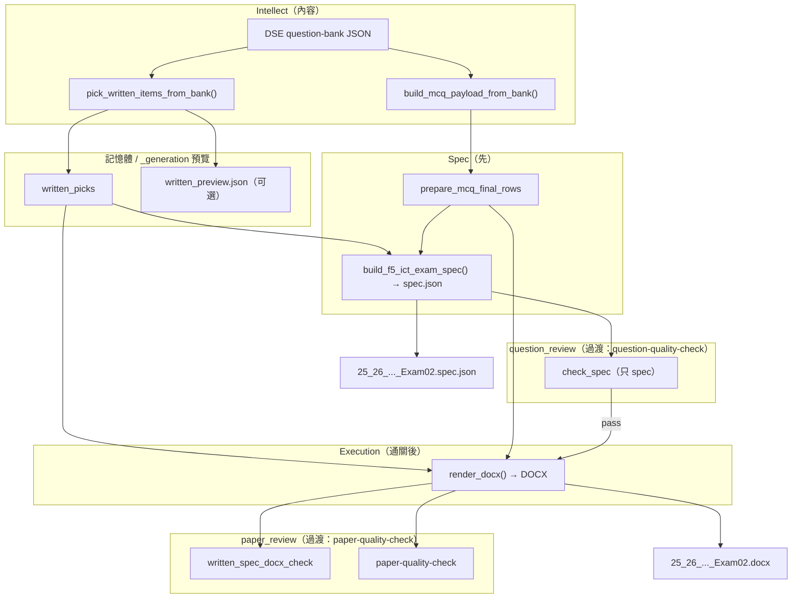
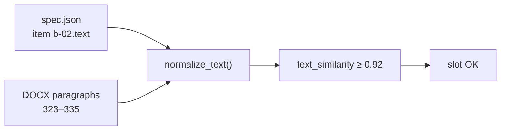

# Exam spec 與 DOCX（spec ↔ docx）

> **出卷主流程：** [`.cursor/skills/generate-f5-ict-exam/SKILL.md`](../../.cursor/skills/generate-f5-ict-exam/SKILL.md)  
> **目標架構（concept → generate → review）：** [`F5_ICT_CONCEPT_GENERATE_FLOW.md`](F5_ICT_CONCEPT_GENERATE_FLOW.md)  
> 本文只係 **spec ↔ DOCX 對齊** 實作細節。

## 流程版本

| 版本 | 內容來源 | spec 點嚟 | 下文圖 |
|------|----------|-----------|--------|
| **目標** | generate（style patterns + blueprint） | agent / `generate_item` | 見 `F5_ICT_CONCEPT_GENERATE_FLOW.md` |
| **過渡（現行）** | bank pick + transform | `regenerate_exam02.py` | 下面 mermaid |

說明 F5 ICT 出卷時 **`*.spec.json`** 同 **`WrittenExam/*.docx`** 嘅關係、生成順序，同 **「spec == docx」** 檢查嘅意思。

> **唔係** JSON → Markdown → DOCX。中間冇 `.md` 卷面檔；`_generation/*.json` 只係預覽／審計報告。

---

## 兩份產物各自做乜

| 產物 | 路徑示例 | 用途 |
|------|----------|------|
| **Exam spec** | `_generation/25_26_S5_ICT_Exam02.spec.json` | 每題一段 **純文字** `text`，俾查重、concept、答案鍵、bank 相似度等 **機械檢查** |
| **DOCX** | `WrittenExam/25_26_S5_ICT_Exam02.docx` | 跟校內模板（如 `24_25`）排版嘅 **交付卷面**（字體、表格、答題空位） |

Schema 見 `shared-tools/question-quality-check/exam_spec.py`（version 1：`items[]` 每條有 `id`、`section`、`text`、`marks`、`concepts`…）。

---

## 過渡流程（F5 ICT，`regenerate_exam02.py` / 方案 A）

> 將由 **generate → spec** 取代 bank pick。內容來源現為 **DSE 題庫揀題**（`written_picks`、MCQ rows），**唔經 Markdown**。



### 步驟（現行實作，`regenerate_exam02.py`）

1. 從 bank **揀** 甲部 MCQ、乙丙 `written_picks`（可寫 `written_preview.json`）。
2. `set_active_written_picks(written_picks)`。
3. **`prepare_mcq_final_rows` → `build_f5_ict_exam_spec` → save spec** — 乙丙用 **`pick_slot_spec_text()`**（與 render 同一套解析）。
4. **`run_question_spec_check`** — 只對 spec：撞題、concept、coherence、bank 等。**未通關唔 render DOCX。**
5. **`generate()` / `render_docx()`** — 複製模板，MCQ + **`written_picks_render`** 全文寫入段落（方案 A）。
6. **`run_post_render_check`** — `paper-quality-check` + **`written_spec_docx_check`**（逐 slot ≥92%）。

**次序：先 spec + question check，後 DOCX + paper check。** 改題只改 spec，通關後先 render。

---

## 「spec == docx」係咩？

**唔係**「spec 檔案格式等於 docx 檔案格式」。

指：對每個乙／丙 slot（`b-01`…`b-06`、`c-01`…`c-08`，見 `written_slot_ranges.py`），

- **spec 側：** `items[]` 入面該 `id` 的 `text`（正規化後）
- **DOCX 側：** 該 slot 對應 **段落範圍** 抽出嚟嘅文字（正規化後）

兩者 **相似度 ≥ 92%** 則該 slot 通過（實測常見 100%）。



實作：`shared-tools/question-quality-check/written_spec_docx_check.py`；在 `check_spec.py` 有 DOCX 時自動執行。

### 點解需要（方案 A 之前嘅問題）

| 舊做法 | 問題 |
|--------|------|
| DOCX 用 `f5_ict_written_content.py` 硬編碼情景 | 卷面係舊年模板文字 |
| 只喺 picks 做 `scenario_override` 換首句 | spec 記錄新情景，DOCX 子題仍係舊題 → **唔通順、spec ≠ docx** |

**方案 A：** `written_picks_render` 用 picks **全文** 寫入 DOCX；spec 用 `pick_slot_spec_text()` 登記同一全文。

---

## `_generation/` 常見 JSON（唔係 Markdown）

| 檔案 | 內容 |
|------|------|
| `*.spec.json` | 全卷題目文字（主登記簿） |
| `written_preview.json` | 揀題摘要、bank 相似度 |
| `mcq_preview.json` | 甲部預覽 |
| `*.spec.duplicates.json` | 查重報告 |
| `*.bank_risk.json` / `*.dse_bank_audit.json` | 與 DSE bank 相似度審計 |

說明性 `.md`（例如本文、`F5_ICT_CONCEPT_GENERATE_FLOW.md`）只係文檔，**唔會**自動變成卷面。

---

## 手動驗證 spec ↔ DOCX

```bash
cd /path/to/school-agent-os
.venv/bin/python << 'PY'
from pathlib import Path
import sys
sys.path.insert(0, "shared-tools/question-quality-check")
sys.path.insert(0, "shared-tools/paper-formatter")
from exam_spec import load_spec
from written_spec_docx_check import check_written_spec_docx, format_written_spec_docx_report

spec = load_spec(Path("Subjects/S5-ICT/past-papers/2025-2026/Term 02/_generation/25_26_S5_ICT_Exam02.spec.json"))
docx = Path("Subjects/S5-ICT/past-papers/2025-2026/Term 02/WrittenExam/25_26_S5_ICT_Exam02.docx")
print(format_written_spec_docx_report(check_written_spec_docx(spec, docx)))
PY
```

---

## 相關程式

| 模組 | 角色 |
|------|------|
| `f5_ict_written_from_dse.py` | 從 bank 揀 `written_picks` |
| `written_picks_render.py` | picks → DOCX 段落行 |
| `written_slot_ranges.py` | slot → DOCX 段落 index |
| `f5_ict_spec.py` | picks → spec `items[]` |
| `f5_ict_blueprint_db_web.py` | `generate()` 組裝 DOCX |
| `build_f5_exam02.py` | **主入口：** generate → partial regen → render |
| `render_from_spec.py` | spec → DOCX + paper_review（`spec_mcq_render` + `written_picks_render`） |
| `question_review.py` / `paper_review.py` | Review CLI（`post_check` 別名） |
| `regenerate_exam02.py` | **Legacy wrapper** → `build_f5_exam02.py`；`--legacy-pick` 為舊 bank pick |
| `post_check.run_question_spec_check` | 出卷前：只驗 spec |
| `post_check.run_post_render_check` | render 後：版面 + spec↔docx |

目標流程（generate 唔抄 bank、partial regen）見 [`F5_ICT_CONCEPT_GENERATE_FLOW.md`](F5_ICT_CONCEPT_GENERATE_FLOW.md)。  
舊 pick 藍本流程文檔已移除（2026-05）；僅保留 [`F5_ICT_CONCEPT_GENERATE_FLOW.md`](F5_ICT_CONCEPT_GENERATE_FLOW.md)。
