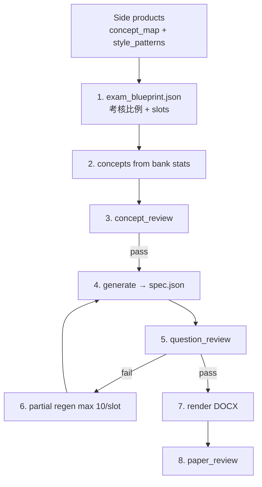

# F5 ICT 出卷：Concept → Generate → Review（目標流程）

> **狀態：目標架構（2026-05）** — skill 主文檔：`.cursor/skills/generate-f5-ict-exam/SKILL.md`  
> **過渡實作：** `regenerate_exam02.py`（bank pick + transform）仍可用，但唔再擴充；見文末 Legacy。

## 點解改方向？

| 舊做法（pick-transform） | 問題 |
|--------------------------|------|
| 從 `question-bank` **揀** DSE 題再改寫 | stem 本質係 DSE 原文，難降到 ≤60% |
| similarity 做 **pick gate** | 成卷 re-seed（80×120 MCQ tries），長時間 silent |
| 「quality check」一次過 | 概念問題同相似度問題混埋，難 partial fix |

**新做法：** bank → **patterns + concept map**（side products）→ **generate** 新題 → **review**（可分階段、可只 regen 失敗 slot）。

---

## Side products（唔係試卷，係出卷基建）

### 1. `concept_map.json`（tree）

**來源：**

- `Subjects/DSE-ICT/edb/ICT_C&A Guide_c_final.pdf` — 必修 A–E、選修 EA–EC 單元結構
- `Subjects/DSE-ICT/question-bank/` — 每 concept 出現次數、常見 marks、DSE 年份分布
- `MarkingScheme` / 評卷 — **common_mistakes**（待 extract）

**結構（建議）：**

```json
{
  "version": 2,
  "source": "Subjects/DSE-ICT/edb/ICT_C&A Guide_c_final.pdf",
  "tree": {
    "A": {
      "label": "資訊處理",
      "topics": {
        "A-b": {
          "label": "數據組織及數據控制",
          "concepts": ["欄位", "記錄", "鍵值"],
          "common_mistakes": ["混淆欄位與記錄"]
        }
      }
    }
  }
}
```

**現有可重用：** `Subjects/DSE-ICT/question-bank/curriculum_concepts.json`（flat keyword→concept）→ Phase 2 升級為 tree。

**建議路徑：** `Subjects/DSE-ICT/question-bank/concept_map.json`

### 2. `style_patterns.json`（問法庫，唔係題庫）

從 bank **extract**，唔保留完整 stem：

| 欄位 | 例子 |
|------|------|
| `concept` | `試算表` |
| `question_types` | `mcq`, `short`, `sql`, `erd` |
| `command_verbs` | `以下哪一項正確描述`, `寫出` |
| `terminology` | `欄位`, `記錄`, `SELECT` |
| `scenario_frames` | `網店訂單`, `戲院預訂` |
| `subpart_templates` | `(a) 寫出 CREATE TABLE…` |
| `distractor_patterns` | MCQ 常見混淆項類型 |

**建議工具（待建）：** `shared-tools/paper-generator/extract_style_patterns.py`  
**建議路徑：** `Subjects/DSE-ICT/question-bank/style_patterns.json` 或 per-exam `_generation/style_patterns.json`

---

## 八步流程（operator + agent）



### Step 1 — `exam_blueprint.json`

放 `Subjects/S5-ICT/past-papers/{學年}/Term {NN}/_generation/`。

- 卷面：甲 30 / 乙 30 / 丙 43；MCQ Core A→B→D block order
- 每 slot：`id`, `section`, `marks`, `concepts[]`, `question_type`
- `meta.concept_targets` — 全卷 concept 次數上下限（見 `f5_ict_spec.py`）

### Step 2 — Concepts from bank

- 用 bank 統計「邊啲 concept DSE 點考」作 **參考**，唔 copy 題文
- 對照 `concept_map.json` 揀考核點

### Step 3 — concept_review

檢查項：

- slot 間 concept 重覆是否合理
- 對 C&A tree：out-of-syllabus（`out_of_syllabus_rules`）
- common mistakes 有冇覆蓋到（選用）
- blueprint `concept_targets` min/max

**產物：** `*.concept_review.json`（pass / issues / regenerate_concepts）

### Step 4 — Generate

- **輸入：** blueprint slot + `style_patterns` + `concept_map`
- **輸出：** `exam_spec` item（`text`, `concepts`, `marks`, `meta.provenance` = `generated` 唔係 `bank_id`）
- **執行：** agent 撰寫 或 日後 `generate_item(slot, blueprint, patterns, rng)`

### Step 5 — question_review

等同現行 `run_question_spec_check`（過渡名），檢查：

| 檢查 | 說明 |
|------|------|
| Duplicate | vs 校內 past + template |
| Bank similarity | vs `DSE-ICT/question-bank`（**review**，唔 block pick） |
| Coherence | 乙丙 scenario / subpart 通順 |
| Answers | MCQ key、缺答案 |
| Concepts | MCQ A→B→D sequence |

### Step 6 — Partial regen

```text
FOR each slot_id IN failed_slots:
  FOR attempt IN 1..10:
    regenerate slot_id only
    IF question_review(slot_id).ok: BREAK
  ELSE: append to unresolved_slots report
STOP — no whole-paper re-seed loop
```

### Step 7 — Render DOCX

- `generate()` / `render_docx()` — 模板 `24_25_S5_ICT_Exam02.docx`
- 甲部、封面、footer：現行 render **OK**
- 乙丙：`written_picks_render`（方案 A）；layout 持續改善（另開 task）

### Step 8 — paper_review

- `run_post_render_check` — footer、cover、乙丙結構
- `written_spec_docx_check` — 每 slot spec text vs DOCX ≥92%

---

## Review 命名對照

| 目標名 | 現行模組 | 輸入 |
|--------|----------|------|
| concept_review | `concept_check.py`（待獨立 CLI） | blueprint + concept_map |
| question_review | `check_spec.run_question_check` | `*.spec.json` |
| paper_review | `post_check.run_post_render_check` | spec + DOCX |

程式改名可 Phase 7 做；skill 先用 **review** 稱呼。

---

## Similarity 政策（新）

| 階段 | 角色 |
|------|------|
| Generate | 唔讀 bank stem；自然低相似 |
| question_review | 甲部 stem 目標 ≤60% vs bank + past；乙丙 stem ≤60%、子題 ≤85% |
| Fail | regen **該 slot only**，唔成卷 retry |

常數仍喺 `f5_ict_from_dse.py` / `quality_lib.py`（過渡）；pick-time gate 將 **移除**。

---

## 實施 phase

| Phase | 交付 | 狀態 |
|-------|------|------|
| **0** | Skill + 本文 + `EXAM_SPEC_AND_DOCX` 更新 | ✅ |
| **1** | `extract_style_patterns.py` | 🔲 |
| **2** | `concept_map.json` tree | 🔲 |
| **3** | `exam_blueprint.json` schema + `concept_review` | 🔲 |
| **4** | Generate → spec（agent / `generate_item`） | 🔲 |
| **5** | Partial regen wrapper（max 10/slot） | 🔲 |
| **6** | 乙丙 DOCX render 改善 | 🟡 |
| **7** | Deprecate `pick_written` / `build_mcq_payload` pick gate | 🔲 |

---

## Legacy：`regenerate_exam02.py`

仍執行：pick → spec → `run_question_spec_check` → DOCX → `run_post_render_check`。

**唔再：**

- 加大 `MAX_SEED_TRIES` 或 pick-time similarity gate
- 擴充 transform heuristics 只為過 60%

**短期 workaround：** 用現有 `25_26_S5_ICT_Exam02.spec.json` 做 review + render；避免全量 re-pick。

舊規劃文檔 `F5_ICT_DSE_BLUEPRINT_FLOW.md` 保留作歷史參考（2019 bank blocker 等已過時）。

---

## 相關路徑

| 角色 | Path |
|------|------|
| C&A Guide | `Subjects/DSE-ICT/edb/ICT_C&A Guide_c_final.pdf` |
| Bank | `Subjects/DSE-ICT/question-bank/` |
| Curriculum (flat) | `.../curriculum_concepts.json` |
| Template | `Subjects/S5-ICT/past-papers/2024-2025/Term 02/WrittenExam/24_25_S5_ICT_Exam02.docx` |
| Spec / generation | `Subjects/S5-ICT/past-papers/2025-2026/Term 02/_generation/` |
| Spec↔DOCX | `EXAM_SPEC_AND_DOCX.md` |
