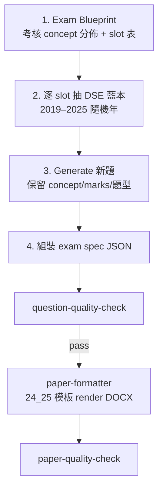

# F5 ICT 出卷流程（DSE 題庫藍本 → 新題 → Formatter）

> **⚠️ 歸檔（2026-05）** — 已被 **[`F5_ICT_CONCEPT_GENERATE_FLOW.md`](F5_ICT_CONCEPT_GENERATE_FLOW.md)** 取代。  
> 現行 operator 流程見 **[`.cursor/skills/generate-f5-ict-exam/SKILL.md`](../../.cursor/skills/generate-f5-ict-exam/SKILL.md)**。  
> 下文保留作歷史參考（當時 bank 未齊、pick 藍本等假設已過時）。

---

> **原狀態：規劃中（2026-05）** — `Subjects/DSE-ICT/question-bank/` 尚未齊備 2019–2025 各卷 JSON，**暫不實作自動抽題**；本文先記低目標流程與現有工具接軌方式。

## 背景：點解而家份卷「好似」但仍過到 check？

現行 recipe（`f5_ict_blueprint_db_web.py`）嘅問題唔係完全抄字，而係：

| 環節 | 而家做乜 | 點解仍覺得似 |
|------|----------|--------------|
| **內容來源** | 人手寫死喺 `f5_ict_written_content.py` | 情境同 `24_25_S5_ICT_Exam02.docx` 幾乎同一套（試算表、上載短片、CUSTOMER 表…） |
| **Duplicate check** | `question-quality-check`：與 **template + 校內 past 3 年** DOCX/spec 比對，相似度 **>60%** 先 fail | 改寫足夠多字詞就可以低於 60%；**唔會**同 DSE 題庫比 |
| **Concept check** | 只驗 `meta.concept_targets` 次數（min/max） | 有標 `concepts` 就得；**唔要求**每題來自不同 DSE 年份 |
| **Layout** | 跟 `24_25` 模板 paragraph/table slot 1:1 | 結構相同 → 睇落就係同一款卷 |

所以 check **pass** 只代表：字面上未同 template／校內舊卷撞得夠利害 + concept 次數合規，**唔代表**題目有 DSE 級多樣性。

---

## 目標流程（四步）



### Step 1 — 製作考核 Concept 分佈（Blueprint）

**產物：** `exam_blueprint.json`（建議放 `Subjects/S5-ICT/past-papers/{學年}/Term {NN}/_generation/`）

Blueprint **唔係**成份 spec 全文，而係「出卷規格」：

- **卷面結構**（跟校內模板）：甲 30 分 / 乙 30 分 / 丙 43 分；乙 6 題、丙 8 題（見 `24_25_S5_ICT_Exam02.docx` slot map）
- **每 slot 一條**：`id`、`section`（mcq / section_b / section_c）、`marks`、`concepts[]`、`question_type`（mcq / short / structured / long / sql / erd…）
- **全卷 concept 分佈**：`meta.concept_targets`（已有，見 `f5_ict_spec.py`）
- **選修範圍**：例如 S5 Term2 = 數據庫 elective only（唔出 networking / web dev）

**現有可重用：**

| 檔案 | 用途 |
|------|------|
| `f5_ict_spec.py` → `meta.concept_targets` | 全卷 concept 次數上下限 |
| `f5_ict_spec.py` → `MCQ_CONCEPTS` + b-01…b-06、c-01…c-08 | 每 slot 預設 concepts（可改做 blueprint 來源） |
| `dse_ict_style_guide.json` | DSE 用語、動詞、terminology |
| `f5_ict_written_content.py` + `f5_ict_tables.py` | **只作 layout slot 參考**，唔再作內容來源 |

**Blueprint slot 示例（schema 草案）：**

```json
{
  "version": 1,
  "meta": {
    "title": "25-26 S5 ICT Exam02 Blueprint",
    "elective": "database",
    "total_marks": 100,
    "concept_targets": { "數據庫": { "min": 3, "max": 12 } }
  },
  "slots": [
    {
      "id": "mcq-01",
      "section": "mcq",
      "marks": 1,
      "concepts": ["進制", "十六進制"],
      "dse_paper_types": ["Paper1_MultipleChoice"],
      "layout": { "paragraph_span": null, "table_ids": [] }
    },
    {
      "id": "b-01",
      "section": "section_b",
      "marks": 4,
      "concepts": ["試算表", "IF"],
      "dse_paper_types": ["Paper1_MultipleChoice"],
      "layout": { "paragraph_range": [313, 322], "table_ids": [3] }
    }
  ]
}
```

> `layout` 對應 `paper-formatter` 嘅固定 slot（`24_25` 模板 paragraph 索引、table 編號），**內容**由 step 2–3 生成。

---

### Step 2 — 從 DSE question-bank 抽藍本（按 concept）

**資料來源：** `Subjects/DSE-ICT/question-bank/{year}/{paper_slug}/questions.json`

**索引：** `Subjects/DSE-ICT/question-bank/index.json`（`questions_json` 路徑、`by_type` 題目 ID 列表）

**演算法（每個 blueprint slot）：**

1. 在 `year_pool`（建議 **2019–2025** 的 DSE 年，可含 Practice/Sample）中 **隨機抽一年**（可設 `seed` 以便重現）。
2. 在該年、該 slot 允許的 `dse_paper_types` 內搜尋 `items[]`：
   - `concepts` 與 slot 的 concept **有交集**（或透過 concept taxonomy 映射，見下）。
3. 若該年無匹配 → **換年重試**（上限 N 次）→ 仍無則標 `needs_manual_blueprint`。
4. 記錄 **provenance**：`{ "blueprint_id": "2019-Paper1_MultipleChoice-Q07", "year": "2019", "similarity_role": "style_only" }`。

**Concept 對齊（待題庫齊後實作）：**

- 短期：題庫 item 加 `concepts[]`（OCR 後 LLM tag 或人手）
- 中期：用 `dse_ict_style_guide.json` → `terminology` 做 keyword 匹配
- 長期：embedding / 課題代碼（Core A/B/D、Elective A…）

**S5 校內卷 vs DSE 卷對應：**

| 校內部 | DSE 來源 |
|--------|----------|
| 甲部 MCQ ×30 | `Paper1_MultipleChoice` |
| 乙部 ×6 | `Paper1` 長題 / 情景題（必修） |
| 丙部 ×8（DB elective） | `Paper2A_Database` |

---

### Step 3 — 以藍本 generate 全新題目

**輸入：** blueprint slot + DSE 藍本 item（stem、options、tables 描述、marks、concepts）

**輸出：** 一條 **新** `exam_spec` item（`text` + `concepts` + `marks` + `meta.provenance`）

**生成原則：**

- **保留：** 考核 concept、分值、題型（MCQ 四選一 / SQL 填寫 / ERD 繪圖…）、DSE 語境難度
- **必須改：** 情境名詞、數字、表名、人名、選項排列（MCQ shuffle 已有 `mcq_answer_keys.py`）
- **禁止：** 與藍本或校內/DSE 舊卷 >60% 相似（生成後再跑 check）
- **參考：** `dse_ict_style_guide.json` 嘅 `command_verbs`、`bilingual_convention`

**建議模組（未建）：** `shared-tools/paper-generator/dse_item_generator.py`

```text
generate_item(slot, dse_blueprint_item, *, rng) -> exam_spec.Item
```

可選 LLM（`refine_dse_ict_question_bank.py` 同一 provider）或 rule-based 改寫；**spec 為 source of truth**，DOCX 只係 render。

---

### Step 4 — 組裝 spec → Formatter → 校內卷 DOCX

1. **組裝** `25_26_S5_ICT_Exam02.spec.json`（44 條：30 MCQ + 6 乙 + 8 丙）
2. **`post_check.run_spec_check`**（question + 若已有 docx 則 paper）
3. **Render：** 現有 `f5_ict_blueprint_db_web.generate()` 演進為：
   - 讀 **spec**（唔再讀 `f5_ict_written_content.py` 硬編碼）
   - 模板：`Subjects/S5-ICT/past-papers/2024-2025/Term 02/WrittenExam/24_25_S5_ICT_Exam02.docx`
   - `written_layout` / `f5_ict_tables` 負責 slot 填入同清 unused tables
4. **`paper-quality-check`**（footer、cover、乙丙結構）

**CLI 目標（規劃）：**

```bash
# Phase A：只出 blueprint + 藍本配對（唔 generate）
python shared-tools/paper-generator/f5_ict_from_dse.py plan \
  --blueprint Subjects/S5-ICT/.../exam_blueprint.json \
  --out Subjects/S5-ICT/.../blueprint.plan.json

# Phase B：generate spec + check + render
python shared-tools/paper-generator/f5_ict_from_dse.py build \
  --blueprint ... --plan ... \
  --template Subjects/S5-ICT/.../24_25_S5_ICT_Exam02.docx \
  --output Subjects/S5-ICT/.../25_26_S5_ICT_Exam02.docx
```

---

## 前置條件：question-bank 覆蓋（blocker）

`index.json` 現況（2026-05）：

| 內容 | 狀態 |
|------|------|
| PDF（2012–2023 + Practice/Sample） | ✅ 已有 |
| `questions.json` | ⚠️ **只有** `2019/Paper1_MultipleChoice` |
| Paper2A Database（丙部主要來源） | ❌ 未 OCR / 未 JSON |
| 2019–2025 全部 MCQ | ❌ 未齊 |

**建議補齊順序：**

```bash
# 1. OCR + 結構化（按年、按卷）
python shared-tools/pdf-engine/build_dse_ict_question_bank.py --years 2019,2020,2021,2022,2023

# 2. LLM 修正 + concept tags（尤其 Paper2A）
python shared-tools/pdf-engine/refine_dse_ict_question_bank.py \
  --years 2019,2020,2021,2022,2023 \
  --slugs Paper1_MultipleChoice,Paper2A_Database \
  --provider gemini --mode vision

# 3. 更新 index.json / by_concept 索引（新 script 或 extend build script）
```

**最低可行（MVP）：** 齊 `Paper1_MultipleChoice`（2019–2023）+ `Paper2A_Database`（2019–2023）→ 可先出 **甲+丙** DSE 藍本；乙部仍可用 Paper1 情景題。

---

## 建議加強嘅 quality gate（新 flow 專用）

現行 check **保留**，另外加：

| 檢查 | 說明 |
|------|------|
| **Blueprint coverage** | 每 slot 必須有 `dse_blueprint_id` |
| **Cross-slot DSE year diversity** | 同一卷內藍本年份至少 K 個不同（避免 30 題全部来自 2020） |
| **Provenance vs duplicate** | 生成題與其 **藍本** 相似度也要 <60%（唔只同校內卷比） |
| **Concept per slot** | slot.concepts 與生成題 concepts 一致 |
| **DSE bank regression** | 與 `question-bank` 全部已索引題比對（optional strict） |

---

## 與現有檔案對照

| 現有 | 新 flow 角色 |
|------|----------------|
| `f5_ict_blueprint_db_web.py` | 暫時：layout render + 硬編碼內容；日後：只負責 step 4 render |
| `f5_ict_written_content.py` | **退役**為內容來源；slot 結構可保留作 layout 測試 |
| `f5_ict_spec.py` | blueprint → spec 組裝邏輯遷移目標 |
| `question-quality-check/` | step 3 後、step 4 後各跑一次 |
| `paper-formatter/written_layout.py` | 不變 |
| `paper-formatter/f5_ict_tables.py` | 改為按 spec 指示填 table（或 spec 帶 table_cells） |

---

## 實施階段

| Phase | 內容 | 依賴 |
|-------|------|------|
| **0（本文）** | 記低 flow、解釋現 check 局限 | — |
| **1** | 定稿 `exam_blueprint.json` + slot/layout 表（對 `24_25`） | 模板分析 ✅ |
| **2** | 補齊 DSE question-bank 2019–2023（MCQ + 2A） | pdf-engine |
| **3** | `plan`：concept → 隨機年 → 藍本 ID | Phase 1–2 |
| **4** | `generate_item` + 組裝 spec | Phase 3 |
| **5** | Spec-driven render；移除硬編碼 content | Phase 4 |
| **6** | 加強 quality gate + 2019–2025 全年份 | 題庫齊 |

---

## 相關路徑

- 校內模板：`Subjects/S5-ICT/past-papers/2024-2025/Term 02/WrittenExam/24_25_S5_ICT_Exam02.docx`
- 今屆輸出：`Subjects/S5-ICT/past-papers/2025-2026/Term 02/`
- DSE 題庫：`Subjects/DSE-ICT/question-bank/`
- 工具鏈總覽：`shared-tools/README.md`
